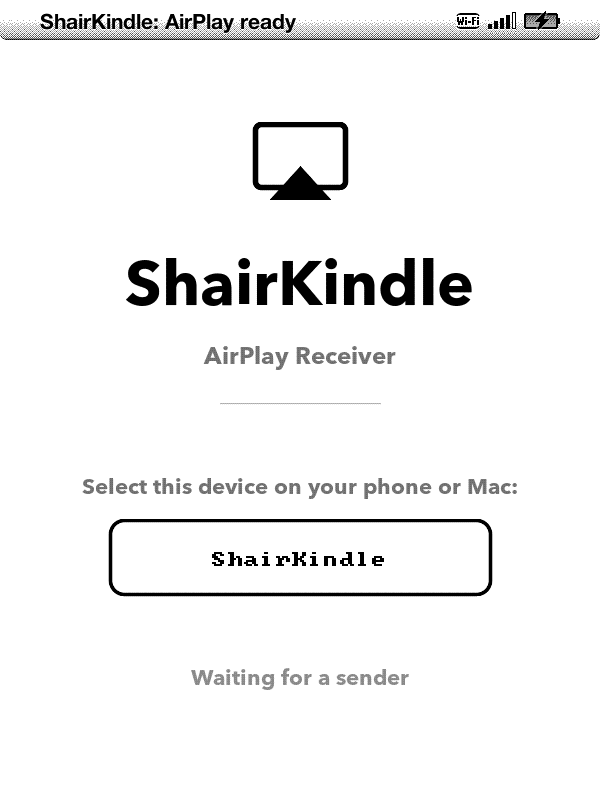

# shairkindle

**Turn a jailbroken Kindle Keyboard (K3) into an AirPlay speaker.**

Stream audio from your iPhone, iPad, Mac, or iTunes/Apple Music straight to the Kindle's
built-in speaker or 3.5 mm headphone jack. The e-ink screen shows a now-playing card —
cover art, title, and artist — and the Kindle's page buttons control play/pause and skip
on the phone you're streaming from.

It's AirPlay 1 (audio only): no video, no multi-room, no buffering — just point your
device's AirPlay picker at your Kindle and press play.

  

> Experimental software for jailbroken Kindles, provided as-is with no warranty. It runs a
> network service on your device — please read [Safety & trust](#safety--trust) below.

## What you need

- A **Kindle Keyboard (K3)** running firmware 3.4.x.
- The **ixtab jailbreak + KUAL** already installed on it. shairkindle does **not** jailbreak
  a stock Kindle — it uses the jailbreak you've already set up. If your Kindle isn't
  jailbroken yet, do that first (that's a separate project).
- **Current Kindle developer certificates** — the trust that lets a jailbroken Kindle run
  sideloaded apps at all. The original certs **expired 2025-04-17**. If KUAL itself opens for
  you today you already have the refresh; if not, see
  [Developer certificates](#developer-certificates) below. shairkindle needs exactly what KUAL
  needs — nothing extra.
- An AirPlay sender on the **same Wi-Fi network** — an iPhone/iPad, or a Mac.

## Developer certificates

shairkindle is a developer-signed Kindlet, so your Kindle has to **trust the current KDK
developer certificates** — the same requirement as KUAL and every other sideloaded app, nothing
shairkindle-specific. Amazon's original developer certs **expired 2025-04-17**. If yours are
missing or expired, opening shairkindle (or KUAL, or anything sideloaded) fails with:

> *This title is not signed by a registered developer.*

The fix is the community **developer-certificate refresh** — a one-time device update, not a
shairkindle download. For the K3:

1. Get the current **DevCerts** keystore-update package (e.g. `DevCerts-20250419-KeyStore.zip`)
   — search the [MobileRead forums](https://www.mobileread.com/) or the
   [Kindle Modding wiki/Discord](https://kindlemodding.org/) for the latest "developer certificate
   update."
2. Extract the `.bin` for **your** K3 model (e.g. `Update_mkk-20250419-k3g-…-keystore-install.bin`)
   and copy it to the **root** of the Kindle's USB drive; eject.
3. On the Kindle: **Home → Menu → Settings → Menu → Update Your Kindle.** It applies the update
   and restarts.

KUAL and shairkindle will then open. (This is standard jailbroken-Kindle housekeeping — the same
step every sideloaded app has needed since April 2025.)

## Install

1. Download **`ShairKindle.azw2`** from the [latest release](../../releases/latest).
   *(Or build it yourself — see [`docs/BUILDING.md`](docs/BUILDING.md).)*
2. Copy it into the **`documents`** folder on the Kindle — plug the Kindle into your
   computer over USB and drag the file onto the drive, into `documents/`.
3. **Eject and restart the Kindle** (or restart the framework) so it shows up on the Home
   screen. It appears as **ShairKindle**.

That's the whole install — it's self-contained. There's no separate setup step, and you
don't need usbnet. The first time you open it, the app unpacks everything it needs into
the Kindle's storage and starts up.

## Using it

1. On the Kindle, open **ShairKindle** from Home. A splash screen appears —
   the AirPlay receiver is now running.
2. On your iPhone/iPad/Mac, open the **AirPlay** picker (Control Center, or the AirPlay
   icon in Music) and choose **ShairKindle**.
3. Play something. Audio comes out of the Kindle, and the screen shows the cover art and
   track info.

**Buttons** (while a track is playing):

| Kindle button | Does |
|---|---|
| Next-page bar | Next track |
| Previous-page bar | Previous track |
| The other page bar | Play / pause |

**To stop:** press **Home**. The receiver shuts down cleanly and hands the screen back.

## Settings

**Wi-Fi is on by default** — shairkindle advertises over Wi-Fi so any sender on your
network can find it, which is all most people need. Running over a USB network tether
instead is an advanced option: set `WIFI=false` in `/var/local/shairkindle/config` on the
device. (A KUAL control menu for toggling this is planned for a later release.)

**Debug logging** (only if you're reporting a bug). Logging is off by default so it can't
slowly fill the Kindle's small storage. To capture a log for a bug report:

- Plug the Kindle into a computer and create an empty file named **`shairkindle-debug`**
  at the top level of the Kindle drive, then eject and reopen the app; **or**
- if you use ssh, run `touch /mnt/us/shairkindle-debug` and relaunch.

The log is written to `/var/local/shairkindle/airplay.log` (fresh each launch). Delete the
`shairkindle-debug` file and relaunch to turn logging back off.

## Troubleshooting

- **"This title is not signed by a registered developer."** Your Kindle's developer certificates
  are missing or expired (the originals lapsed 2025-04-17). Install the certificate refresh — see
  [Developer certificates](#developer-certificates). (KUAL won't open either until you do.)
- **"ShairKindle" doesn't appear in the AirPlay picker.** Make sure the app is open on the
  Kindle (splash screen showing) and that your phone/Mac is on the **same Wi-Fi network**.
  The Kindle's Wi-Fi can be slow to wake — give it a few seconds, or reopen the picker.
- **It connects but there's no sound / it drops after a second.** Confirm the app is still
  running on the Kindle. If it keeps happening, enable debug logging (above) and include the
  log in a bug report.
- **The app doesn't show up on Home after copying the file.** The Kindle only re-scans
  `documents/` on a full restart — restart the Kindle (or the framework) and it'll appear.

## Safety & trust

shairkindle is community-made software for a device you've already jailbroken. A few things
worth knowing, in plain terms:

- It **does not jailbreak your Kindle** and **does not change Amazon's system files** — it
  uses the jailbreak gateway you already installed, and the only things it leaves on disk
  are its own app and its working folder.
- It runs a **network service** that anything on your Wi-Fi can talk to. Only use it on a
  network you trust.

The full trust model — exactly what permissions it uses, what the firewall rule does, and
how to report a security issue — is in [`SECURITY.md`](SECURITY.md).

## Credits

shairkindle is an independent, from-scratch AirPlay-1 receiver — **not a fork of shairport
or shairport-sync.** It re-implements the reverse-engineered RAOP protocol and claims
originality only for the Kindle port (the on-device daemon, display, input, and app). It
stands on a lot of prior work:

- **RAOP protocol** — reverse-engineered by Jon Lech Johansen, James Laird (*hairtunes* /
  *shairport*), and Mike Brady (*shairport-sync*).
- **ALAC decoder** — David Hammerton (MIT). **tinysvcmdns** — Darell Tan (BSD-3-Clause).
  **BearSSL** — Thomas Pornin (MIT). **musl libc** — Rich Felker & contributors (MIT).
  **FBInk** — NiLuJe (GPLv3-or-later), bundled as a separate CLI for the e-ink display.
  **Kindle jailbreak gateway** — ixtab's kindlejailbreak (WTFPL).

Full license texts and pinned upstream versions: [`THIRD-PARTY-NOTICES.md`](THIRD-PARTY-NOTICES.md).

## License

**MIT © 2026 Tymm Zerr** — see [`LICENSE`](LICENSE). The one bundled GPLv3 binary (FBInk)
is a separate program, not linked into shairkindle; its source is offered per GPLv3 §6 in
[`SOURCE-OFFER.txt`](SOURCE-OFFER.txt).

*Not affiliated with, endorsed by, or sponsored by Apple or Amazon. "AirPlay" and "AirPort
Express" are trademarks of Apple Inc.; "Kindle" identifies the target devices.*
